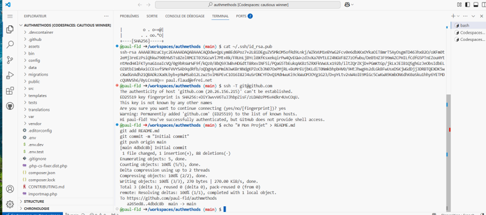

Projet Final : Sécurisation et Authentification avancée d'un Blog avec Symfony

Configuration de la Connexion SSH
Génération de la clé SSH
Clé SSH générée via la commande :

bash
Copier
ssh-keygen -t ed25519 -C "paul.flaud@efrei.net"
Ajout de la clé SSH à GitHub
La clé publique a été copiée puis ajoutée sur GitHub dans la section SSH and GPG Keys.

Vérification de la connexion avec un commit et push
Une fois configurée, un commit suivi d’un git push a permis de confirmer que la connexion SSH était fonctionnelle.

Implémentation de l'Authentification Sécurisée
Option choisie : OAuth2 avec Google
L’authentification des utilisateurs a été implémentée via HWI OAuth Bundle pour permettre une connexion sécurisée avec les comptes Google.

1. Configuration des variables d'environnement dans le fichier .env.local
env
Copier
GOOGLE_CLIENT_ID=1090840468491-5rbj18nt0806ddii9ucpk9j9oldg2iam.apps.googleusercontent.com
GOOGLE_CLIENT_SECRET=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
WEATHER_API_KEY=11772bd9a1bde8348ac474f386d6bf6d
WEATHER_CITY=Paris

2. Configuration de la sécurité dans le fichier security.yaml
yaml
Copier
security:
    providers:
        database_users:
            entity:
                class: App\Entity\User
                property: username

    firewalls:
        main:
            lazy: true
            provider: database_users
            entry_point: App\Security\GoogleEntryPoint
            logout:
                path: /logout
                target: /
            remember_me:
                secret: '%kernel.secret%'
            oauth:
                resource_owners:
                    google: "/login/check-google"
                login_path: /login
                use_forward: false
                failure_path: /login
                oauth_user_provider:
                    service: App\Security\OAuthUserProvider

    access_control:
        - { path: ^/admin, roles: ROLE_ADMIN }
        - { path: ^/blog, roles: IS_AUTHENTICATED_FULLY }
        - { path: ^/login, roles: PUBLIC_ACCESS }

3. Définition des routes pour la connexion
Route fournie automatiquement par HWI OAuth pour la redirection Google :

pgsql
Copier
/login/check-google
Et le bouton dans Twig pointe vers la route :

twig
Copier
<a href="{{ path('hwi_oauth_login') }}">Se connecter avec Google</a>

4. Test de la connexion avec Google
- Connexion réussie
- Compte créé automatiquement en base de données
- Redirection vers le blog après authentification

Affichage de la Météo sur la page Blog
Le service WeatherService utilise l’API OpenWeather pour récupérer et afficher la météo actuelle :

Ville configurable dans .env.local

Affichage : température, description, icône

Affichage responsive et propre via Bootstrap

Captures d'Écran

Connexion SSH réussie

Formulaire de connexion via Google

Page d’accueil du blog avec météo affichée après connexion

Météo qui varie correctement, avec une icône illustrant le temps qu'il fait. 
